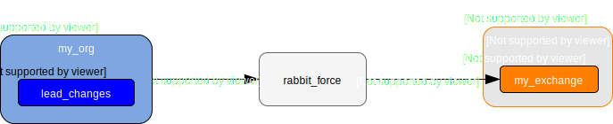
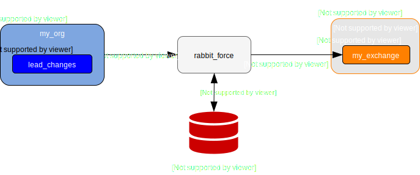
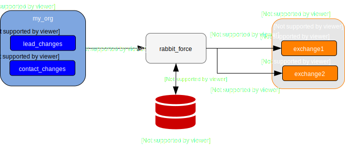
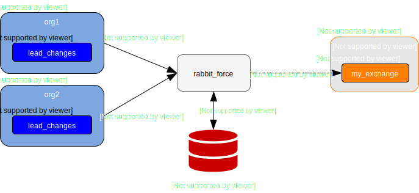
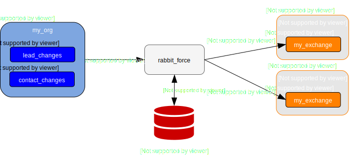
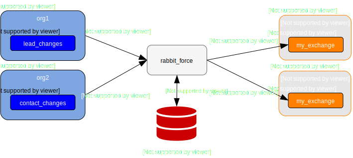

Examples
========

rabbit_force is very flexible. The
:doc:`configuration file's format </configuration>` makes it possible to cover a
wide range of use cases. This section contains several illustrated examples
of varying complexity to give you ideas how you can adapt rabbit_force for
your own use case.

Single source and sink
----------------------

The configuration file below sets up rabbit_force to forward all event messages
from the Salesforce org ``my_org`` and from the PushTopic named
``lead_changes`` to a RabbitMQ broker named ``my_broker`` to the exchange
``my_exchange`` with the routing key of ``event_message``.

.. code-block:: yaml

    source:
      orgs:
        my_org:
          consumer_key: "<consumer_key>"
          consumer_secret: "<consumer_secret>"
          username: "<username>"
          password: "<password>"
          resources:
            - type: PushTopic
              spec:
                Name: lead_changes
                ApiVersion: 42.0
                NotifyForFields: Referenced
                NotifyForOperationCreate: true
                NotifyForOperationUpdate: true
                NotifyForOperationDelete: true
                NotifyForOperationUndelete: true
                Query: SELECT Id, Email, Name, Phone, MobilePhone, Status, LeadSource FROM Lead
    sink:
      brokers:
        my_broker:
          host: localhost
          exchanges:
            - exchange_name: my_exchange
              type_name: topic
              durable: true
    router:
      default_route:
        broker_name: my_broker
        exchange_name: my_exchange
        routing_key: event_message

Single source and sink with replay and routing rules
----------------------------------------------------

The configuration file below sets up rabbit_force to forward all event messages
from the Salesforce org ``my_org`` and from the PushTopic named
``lead_changes`` to a RabbitMQ broker named ``my_broker`` to the exchange
``my_exchange``.

The routing keys of the forwarded messages depend on the event type property.
``created``, ``updated`` and ``deleted`` event messages are forwarded with
the routing keys ``lead.create``, ``lead.update`` and ``lead.delete``
respectively.

rabbit_force is also configured to use a `Redis <redis_>`_ database to store
replay markers, so it can take advantage of the Streaming API's
`message durability <replay_>`_ feature.

.. code-block:: yaml

    source:
      orgs:
        my_org:
          consumer_key: "<consumer_key>"
          consumer_secret: "<consumer_secret>"
          username: "<username>"
          password: "<password>"
          resources:
            - type: PushTopic
              spec:
                Name: lead_changes
                ApiVersion: 42.0
                NotifyForFields: Referenced
                NotifyForOperationCreate: true
                NotifyForOperationUpdate: true
                NotifyForOperationDelete: true
                NotifyForOperationUndelete: true
                Query: SELECT Id, Email, Name, Phone, MobilePhone, Status, LeadSource FROM Lead
      replay:
        address: "redis://localhost:6389"
        key_prefix: replay
    sink:
      brokers:
        my_broker:
          host: localhost
          exchanges:
            - exchange_name: my_exchange
              type_name: topic
              durable: true
    router:
      default_route: null
      rules:
        - condition: "$[?(@.message.channel ~ '.*/lead_changes' & @.message.data.event.type = 'created')]"
          route:
            broker_name: my_broker
            exchange_name: my_exchange
            routing_key: lead.create
        - condition: "$[?(@.message.channel ~ '.*/lead_changes' & @.message.data.event.type = 'updated')]"
          route:
            broker_name: my_broker
            exchange_name: my_exchange
            routing_key: lead.update
        - condition: "$[?(@.message.channel ~ '.*/lead_changes' & @.message.data.event.type = 'deleted')]"
          route:
            broker_name: my_broker
            exchange_name: my_exchange
            routing_key: lead.delete

Single source and sink with replay and complex routing rules
------------------------------------------------------------

The configuration file below sets up rabbit_force to forward event messages
from the Salesforce org ``my_org`` and from the PushTopic named
``lead_changes`` to a RabbitMQ broker named ``my_broker`` to the exchange
``exchange1``, and forward event messages from the PushTopic
``contact_changes`` to the exchange ``exchange2``.

The routing keys of the forwarded messages depend on the event type property.
``created``, ``updated`` and ``deleted`` event messages from the PushTopic
``lead_changes`` are forwarded with the routing keys ``lead.create``,
``lead.update`` and ``lead.delete`` and from the PushTopic ``contact_changes``
they're forwarded with the routing keys of ``contact.create``,
``contact.update`` and ``contact.delete`` respectively.

rabbit_force is also configured to use a `Redis <redis_>`_ database to store
replay markers, so it can take advantage of the Streaming API's
`message durability <replay_>`_ feature.

.. code-block:: yaml

    source:
      orgs:
        my_org:
          consumer_key: "<consumer_key>"
          consumer_secret: "<consumer_secret>"
          username: "<username>"
          password: "<password>"
          resources:
            - type: PushTopic
              spec:
                Name: lead_changes
                ApiVersion: 42.0
                NotifyForFields: Referenced
                NotifyForOperationCreate: true
                NotifyForOperationUpdate: true
                NotifyForOperationDelete: true
                NotifyForOperationUndelete: true
                Query: SELECT Id, Email, Name, Phone, MobilePhone, Status, LeadSource FROM Lead
            - type: PushTopic
              spec:
                Name: contact_changes
                ApiVersion: 42.0
                NotifyForFields: Referenced
                NotifyForOperationCreate: true
                NotifyForOperationUpdate: true
                NotifyForOperationDelete: true
                NotifyForOperationUndelete: true
                Query: SELECT Id, Email, Name, Phone, MobilePhone FROM Contact
      replay:
        address: "redis://localhost:6389"
        key_prefix: replay
    sink:
      brokers:
        my_broker:
          host: localhost
          exchanges:
            - exchange_name: exchange1
              type_name: topic
              durable: true
            - exchange_name: exchange2
              type_name: topic
              durable: true
    router:
      default_route: null
      rules:
        - condition: "$[?(@.message.channel ~ '.*/lead_changes' & @.message.data.event.type = 'created')]"
          route:
            broker_name: my_broker
            exchange_name: exchange1
            routing_key: lead.create
        - condition: "$[?(@.message.channel ~ '.*/lead_changes' & @.message.data.event.type = 'updated')]"
          route:
            broker_name: my_broker
            exchange_name: exchange1
            routing_key: lead.update
        - condition: "$[?(@.message.channel ~ '.*/lead_changes' & @.message.data.event.type = 'deleted')]"
          route:
            broker_name: my_broker
            exchange_name: exchange1
            routing_key: lead.delete
        - condition: "$[?(@.message.channel ~ '.*/contact_changes' & @.message.data.event.type = 'created')]"
          route:
            broker_name: my_broker
            exchange_name: exchange2
            routing_key: contact.create
        - condition: "$[?(@.message.channel ~ '.*/contact_changes' & @.message.data.event.type = 'updated')]"
          route:
            broker_name: my_broker
            exchange_name: exchange2
            routing_key: contact.update
        - condition: "$[?(@.message.channel ~ '.*/contact_changes' & @.message.data.event.type = 'deleted')]"
          route:
            broker_name: my_broker
            exchange_name: exchange2
            routing_key: contact.delete

Multiple sources and a single sink
----------------------------------

The configuration file below sets up rabbit_force to forward all event messages
from the Salesforce orgs ``org1`` and ``org2`` and from the PushTopics named
``lead_changes`` to a RabbitMQ broker named ``my_broker`` to the exchange
``my_exchange`` with the routing key of ``event_message``.

rabbit_force is also configured to use a `Redis <redis_>`_ database to store
replay markers, so it can take advantage of the Streaming API's
`message durability <replay_>`_ feature.

.. code-block:: yaml

    source:
      orgs:
        org1:
          consumer_key: "<consumer_key>"
          consumer_secret: "<consumer_secret>"
          username: "<username>"
          password: "<password>"
          resources:
            - type: PushTopic
              spec:
                Name: lead_changes
                ApiVersion: 42.0
                NotifyForFields: Referenced
                NotifyForOperationCreate: true
                NotifyForOperationUpdate: true
                NotifyForOperationDelete: true
                NotifyForOperationUndelete: true
                Query: SELECT Id, Email, Name, Phone, MobilePhone, Status, LeadSource FROM Lead
        org2:
          consumer_key: "<consumer_key>"
          consumer_secret: "<consumer_secret>"
          username: "<username>"
          password: "<password>"
          resources:
            - type: PushTopic
              spec:
                Name: lead_changes
                ApiVersion: 42.0
                NotifyForFields: Referenced
                NotifyForOperationCreate: true
                NotifyForOperationUpdate: true
                NotifyForOperationDelete: true
                NotifyForOperationUndelete: true
                Query: SELECT Id, Email, Name, Phone, MobilePhone, Status, LeadSource FROM Lead
      replay:
        address: "redis://localhost:6389"
        key_prefix: replay
    sink:
      brokers:
        my_broker:
          host: localhost
          exchanges:
            - exchange_name: my_exchange
              type_name: topic
              durable: true
    router:
      default_route:
        broker_name: my_broker
        exchange_name: my_exchange
        routing_key: event_message

Multiple sources, single sink with routing rules
------------------------------------------------

The configuration file below sets up rabbit_force to forward event messages
from the Salesforce org ``org1`` and from the PushTopic named
``lead_changes`` to a RabbitMQ broker named ``my_broker`` to the exchange
``my_exchange`` with the routing key of ``org1_message``, and forward
event messages from Salesforce org ``org2`` and from the PushTopic named
``lead_changes`` with the routing key of ``org2_message``.

rabbit_force is also configured to use a `Redis <redis_>`_ database to store
replay markers, so it can take advantage of the Streaming API's
`message durability <replay_>`_ feature.

.. code-block:: yaml

    source:
      orgs:
        org1:
          consumer_key: "<consumer_key>"
          consumer_secret: "<consumer_secret>"
          username: "<username>"
          password: "<password>"
          resources:
            - type: PushTopic
              spec:
                Name: lead_changes
                ApiVersion: 42.0
                NotifyForFields: Referenced
                NotifyForOperationCreate: true
                NotifyForOperationUpdate: true
                NotifyForOperationDelete: true
                NotifyForOperationUndelete: true
                Query: SELECT Id, Email, Name, Phone, MobilePhone, Status, LeadSource FROM Lead
        org2:
          consumer_key: "<consumer_key>"
          consumer_secret: "<consumer_secret>"
          username: "<username>"
          password: "<password>"
          resources:
            - type: PushTopic
              spec:
                Name: lead_changes
                ApiVersion: 42.0
                NotifyForFields: Referenced
                NotifyForOperationCreate: true
                NotifyForOperationUpdate: true
                NotifyForOperationDelete: true
                NotifyForOperationUndelete: true
                Query: SELECT Id, Email, Name, Phone, MobilePhone, Status, LeadSource FROM Lead
      replay:
        address: "redis://localhost:6389"
        key_prefix: replay
    sink:
      brokers:
        my_broker:
          host: localhost
          exchanges:
            - exchange_name: my_exchange
              type_name: topic
              durable: true
    router:
      default_route: null
      rules:
        - condition: "$[?(@.org_name = 'org1')]"
          route:
            broker_name: my_broker
            exchange_name: my_exchange
            routing_key: org1_message
        - condition: "$[?(@.org_name = 'org2')]"
          route:
            broker_name: my_broker
            exchange_name: my_exchange
            routing_key: org2_message

Single source with multiple sinks and routing rules
---------------------------------------------------

The configuration file below sets up rabbit_force to forward event messages
from the Salesforce org ``org1`` and from the PushTopic named
``lead_changes`` to a RabbitMQ broker named ``broker1`` to the exchange
``my_exchange`` with the routing key of ``lead_change``, and forward
event messages from the same org and from the PushTopic named
``contact_changes`` to a RabbitMQ broker named ``broker2`` to the exchange
``my_exchange`` with the routing key of ``contact_change``.

rabbit_force is also configured to use a `Redis <redis_>`_ database to store
replay markers, so it can take advantage of the Streaming API's
`message durability <replay_>`_ feature.

.. code-block:: yaml

    source:
      orgs:
        my_org:
          consumer_key: "<consumer_key>"
          consumer_secret: "<consumer_secret>"
          username: "<username>"
          password: "<password>"
          resources:
            - type: PushTopic
              spec:
                Name: lead_changes
                ApiVersion: 42.0
                NotifyForFields: Referenced
                NotifyForOperationCreate: true
                NotifyForOperationUpdate: true
                NotifyForOperationDelete: true
                NotifyForOperationUndelete: true
                Query: SELECT Id, Email, Name, Phone, MobilePhone, Status, LeadSource FROM Lead
            - type: PushTopic
              spec:
                Name: contact_changes
                ApiVersion: 42.0
                NotifyForFields: Referenced
                NotifyForOperationCreate: true
                NotifyForOperationUpdate: true
                NotifyForOperationDelete: true
                NotifyForOperationUndelete: true
                Query: SELECT Id, Email, Name, Phone, MobilePhone FROM Contact
      replay:
        address: "redis://localhost:6389"
        key_prefix: replay
    sink:
      brokers:
        broker1:
          host: localhost
          port: 5672
          exchanges:
            - exchange_name: my_exchange
              type_name: topic
              durable: true
        broker2:
          host: localhost
          port: 5673
          exchanges:
            - exchange_name: my_exchange
              type_name: topic
              durable: true
    router:
      default_route: null
      rules:
        - condition: "$[?(@.message.channel = '/topic/lead_changes')]"
          route:
            broker_name: broker1
            exchange_name: my_exchange
            routing_key: lead_change
        - condition: "$[?(@.message.channel = '/topic/contact_changes')]"
          route:
            broker_name: broker2
            exchange_name: my_exchange
            routing_key: contact_change

Multiple sources and sinks with routing rules
---------------------------------------------

The configuration file below sets up rabbit_force to forward event messages
from the Salesforce org ``org1`` and from the PushTopic named
``lead_changes`` to a RabbitMQ broker named ``broker1`` to the exchange
``my_exchange`` with the routing key of ``org1_message``, and forward
event messages from the Salesforce org ``org2`` and from the PushTopic named
``contact_changes`` to a RabbitMQ broker named ``broker2`` to the exchange
``my_exchange`` with the routing key of ``org2_message``.

rabbit_force is also configured to use a `Redis <redis_>`_ database to store
replay markers, so it can take advantage of the Streaming API's
`message durability <replay_>`_ feature.

.. code-block:: yaml

    source:
      orgs:
        org1:
          consumer_key: "<consumer_key>"
          consumer_secret: "<consumer_secret>"
          username: "<username>"
          password: "<password>"
          resources:
            - type: PushTopic
              spec:
                Name: lead_changes
                ApiVersion: 42.0
                NotifyForFields: Referenced
                NotifyForOperationCreate: true
                NotifyForOperationUpdate: true
                NotifyForOperationDelete: true
                NotifyForOperationUndelete: true
                Query: SELECT Id, Email, Name, Phone, MobilePhone, Status, LeadSource FROM Lead
        org2:
          consumer_key: "<consumer_key>"
          consumer_secret: "<consumer_secret>"
          username: "<username>"
          password: "<password>"
          resources:
            - type: PushTopic
              spec:
                Name: contact_changes
                ApiVersion: 42.0
                NotifyForFields: Referenced
                NotifyForOperationCreate: true
                NotifyForOperationUpdate: true
                NotifyForOperationDelete: true
                NotifyForOperationUndelete: true
                Query: SELECT Id, Email, Name, Phone, MobilePhone FROM Contact
      replay:
        address: "redis://localhost:6389"
        key_prefix: replay
    sink:
      brokers:
        broker1:
          host: localhost
          port: 5672
          exchanges:
            - exchange_name: my_exchange
              type_name: topic
              durable: true
        broker2:
          host: localhost
          port: 5673
          exchanges:
            - exchange_name: my_exchange
              type_name: topic
              durable: true
    router:
      default_route: null
      rules:
        - condition: "$[?(@.org_name = 'org1')]"
          route:
            broker_name: broker1
            exchange_name: my_exchange
            routing_key: org1_message
        - condition: "$[?(@.org_name = 'org2')]"
          route:
            broker_name: broker2
            exchange_name: my_exchange
            routing_key: org2_message

.. include:: global.rst
