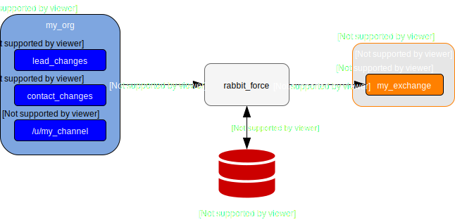

rabbit_force
============

.. image:: https://readthedocs.org/projects/rabbit-force/badge/?version=latest
    :target: https://rabbit-force.readthedocs.io/en/latest/?badge=latest
    :alt: Documentation Status

.. image:: https://travis-ci.org/robertmrk/rabbit_force.svg?branch=develop
    :target: https://travis-ci.org/robertmrk/rabbit_force
    :alt: Build status

.. image:: https://coveralls.io/repos/github/robertmrk/rabbit_force/badge.svg
    :target: https://coveralls.io/github/robertmrk/rabbit_force
    :alt: Coverage

.. image:: https://img.shields.io/badge/License-MIT-yellow.svg
    :target: https://opensource.org/licenses/MIT
    :alt: MIT license

rabbit_force is a `Salesforce Streaming API <api_>`_ to `RabbitMQ <rabbitmq_>`_
adapter service. It listens for event messages from
`Salesforce's Streaming API <api_>`_ and forwards them to a
`RabbitMQ broker <rabbitmq_>`_ for you, so you don't have to.

`Streaming API <api_>`_ is useful when you want notifications to be pushed from
the server to the client based on criteria that you define with
`PushTopics <PushTopic_>`_ or to receive
`generic streaming <GenericStreaming_>`_ messages. While
`RabbitMQ <rabbitmq_>`_ is one of the most popular options for implementing
inter-service communication in a `microservice architecture <microservice_>`_.

While there are lots of great client implementations for RabbitMQ/AMQP for
various languages, there are a lot less Streaming API clients, and many of them
are badly maintained. Furthermore RabbitMQ offers much more flexible message
consumption techniques.

rabbit_force aims to fix these problems, by providing and adapter between the
Streaming API and RabbitMQ, so inter-connected services can consume Streaming
API event messages with RabbitMQ. It even supports connection with multiple
Salesforce orgs, multiple RabbitMQ brokers, and routing messages between them.

Features
--------

- Forward `Streaming API <api_>`_ messages from one or more Salesforce orgs to
  one or more `RabbitMQ brokers <rabbitmq_>`_
- Route incoming messages to a specific broker and exchange with the
  specified routing key and properties, with the help of routing rules defined
  as `JSONPath <jsonpath_>`_ expressions
- Support for Salesforce's replay extension for `message reliability and
  durability <replay_>`_ by storing replay markers in a `Redis <redis_>`_
  database
- Configurable error handling behavior, either fail instantly or try to recover
  from network and service outages
- Message sources, sinks and routing configurable with JSON or YAML
  configuration files
- Implemented using `python asyncio <asyncio_>`_ for efficient handling of
  IO intensive operations

Usage
-----

A relatively simple use case is illustrated on the image bellow. rabbit_force
is connected to a single message source and message sink, or in other words to
a single Salesforce org named as ``my_org`` and a single RabbitMQ broker named
``my_broker``. It listens for messages from two PushTopics (``lead_changes``
and ``contact_changes``) and a StreamingChannel (``my_channel``), and forwards
messages into the exchange ``my_exchange`` with different routing keys. A redis
database is used to store raplay markers sent by Salesforce to take advantage
of `message durability <replay_>`_.

The configuration file bellow sets up rabbit_force to forward messages from
``lead_changes``, ``contact_changes`` and ``my_channel`` with the routing keys
of ``lead_change_message``, ``contact_change_message`` and
``my_channel_message`` respectively.

.. code-block:: yaml
    :caption: config.yaml

    # message source definition
    source:
      # mapping of Salesforce orgs to use as message sources
      orgs:
        # a Salesforce org named as "my_org"
        my_org:
          # authentication credentials
          consumer_key: "<consumer_key>"
          consumer_secret: "<consumer_secret>"
          username: "<username>"
          password: "<password>"
          # list of resources that the service can listen to for messages
          # if they doesn't exist, they'll be created on application startup
          resources:
            # a PushTopic resource
            - type: PushTopic
              # the definition of the PushTopic
              spec:
                Name: lead_changes
                ApiVersion: 42.0
                NotifyForFields: Referenced
                NotifyForOperationCreate: true
                NotifyForOperationUpdate: true
                NotifyForOperationDelete: true
                NotifyForOperationUndelete: true
                Query: SELECT Id, Email, Name, Phone, MobilePhone, Status, LeadSource FROM Lead
              # optional durable flag, if false then the resource will be removed on application shutdown
              durable: false

            # a PushTopic resource
            - type: PushTopic
              # the definition of the PushTopic
              spec:
                Name: contact_changes
                ApiVersion: 42.0
                NotifyForFields: Referenced
                NotifyForOperationCreate: true
                NotifyForOperationUpdate: true
                NotifyForOperationDelete: true
                NotifyForOperationUndelete: true
                Query: SELECT Id, Email, Name, Phone, MobilePhone FROM Contact
              # optional durable flag, if false then the resource will be removed on application shutdown
              durable: false

            # s StreamingChannel resource
            - type: StreamingChannel
              spec:
                Name: /u/my_channel
                Description: Streaming channel for notifications
              durable: false
      # optional replay storage definition. if defined it'll be used to store replay
      # markers sent by Salesforce in order to support message durability
      replay:
        # redis server address
        address: "redis://localhost:6389"
        # key prefix
        key_prefix: replay

    # message sink definition
    sink:
      # mapping of RabbitMQ brokers to use as message sinks
      brokers:
        # a RabbitMQ broker named as "by_broker"
        my_broker:
          # host name of the broker
          host: localhost
          # definition of the exchange where the messages should be forwarded
          exchanges:
            - exchange_name: my_exchange
              type_name: topic
              durable: true

    # message router definition
    router:
      # optional default route to use if no routing rule matches a given message
      default_route:
        broker_name: my_broker
        exchange_name: my_exchange
        routing_key: my_channel_message

      # list of routing rules
      rules:
        # JSONPath filter expression as the condition
        - condition: "$[?(@.message.channel ~ '.*/lead_changes')]"
          # the route to use if the condition produces a non-empty match
          route:
            broker_name: my_broker
            exchange_name: my_exchange
            routing_key: lead_change_message
        # JSONPath filter expression as the condition
        - condition: "$[?(@.message.channel ~ '.*/contact_changes')]"
          # the route to use if the condition produces a non-empty match
          route:
            broker_name: my_broker
            exchange_name: my_exchange
            routing_key: contact_change_message

A sample run of rabbit_force with the above configuration file.

.. code-block:: bash

    $ python -m rabbit_force config.yaml
    2018-06-19 16:23:07,909:INFO: Starting up ...
    2018-06-19 16:23:07,996:INFO: Configuration loaded from 'config.yaml'
    2018-06-19 16:23:07,999:INFO: Configuring application ...
    2018-06-19 16:23:10,619:INFO: Using message broker AmqpBroker(host='localhost', port=None, login='guest', password='guest', virtualhost='/', ssl=False, login_method='AMQPLAIN', insist=False, verify_ssl=True)
    2018-06-19 16:23:12,128:INFO: Listening for messages from Salesforce org 'my_org':
        * from PushTopic 'lead_changes' on channel '/topic/lead_changes'
        * from PushTopic 'contact_changes' on channel '/topic/contact_changes'
        * from StreamingChannel '/u/my_channel' on channel '/u/my_channel'
    With replay storage RedisReplayStorage(address='redis://localhost:6389', key_prefix='replay:my_org', additional_params={}, ignore_network_errors=False).
    2018-06-19 16:23:48,119:INFO: Forwarded message 1 on channel '/topic/lead_changes' from 'my_org' to Route(broker_name='my_broker', exchange_name='my_exchange', routing_key='lead_change_message', properties=None).
    2018-06-19 16:24:03,039:INFO: Forwarded message 1 on channel '/topic/contact_changes' from 'my_org' to Route(broker_name='my_broker', exchange_name='my_exchange', routing_key='contact_change_message', properties=None).
    2018-06-19 16:24:20,180:INFO: Forwarded message 1 on channel '/u/my_channel' from 'my_org' to Route(broker_name='my_broker', exchange_name='my_exchange', routing_key='my_channel_message', properties=None).
    2018-06-19 16:24:27,097:INFO: Shutting down ...

Contents
--------

.. toctree::
   :maxdepth: 2

   guide
   modules
   changes

Indices and tables
==================

* :ref:`genindex`
* :ref:`modindex`
* :ref:`search`

.. include:: global.rst
